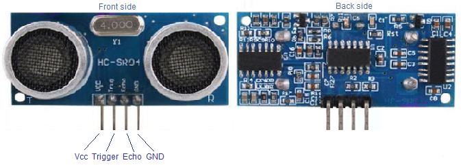

# Ultrasonic Distance Measurement using Arduino and Seven Segment
Ultrasonic Distance Measurement using Arduino is used to find the distance of the object from the sensor. It's mostly used in SONAR system to estimate the depth of the water in any water body like Ocean, River, etc. 
HC-SR04 ultrasonic range finder module is used as the sensor here. The display consists of a three digit multiplexed seven segment display. This range finder can measure up to 200 cm and has an accuracy of 1cm.
## HC SR04 ultrasonic module.
HC SR04 is an ultrasonic distance measurement sensor with an accuracy of 0.3cm. The sensing range of this module is from 2cm to 5 meter. Working current of this sensor is 15mA and the measuring angle is 15°. The photograph of front and back side of the HC-SR04 sensor is shown in the figure below.

HC-SR04 has four pins. Their names and functions are explained below :

**Vcc**: 5V supply voltage is given to this pin.

**Trigger**: A 10uS long pulse is given to this pin for triggering the transmission. Upon receiving a valid trigger pulse, the HR-SR04 issues eight 40KHz pulses. Time taken by these pulses to reflect back is measured and the distance is calculated from it.

**Echo**: At this pin the HC-SR04 outputs a signal whose high time is proportional to the range.

**Ground** : Ground is connected to this pin.

## About the Program
I had used SevSeg.h library that you will find in my repository. I had send the 10uS trigger pulse using DigitalWrite() in Arduino UNO.
The pulseIn keyword is used to detect the high pulse in the echo pin of the ultrasonic Sensor. It produces pulse proportional to the distance of the object from the sensor i.e the far the far object is the more time required for the echo pin to receive the reflection pulse.
I have also uploaded the .ino file of this project. 
### Pin connection:
* Sensor Trigger Pin is connected to A1 pin of Arduino.

* Sensor Echo pin is connected to A0 pin of Arduino.

* Display pin of Hundredth, Tenth and Unit Seven Segments display are connected to Pin 13,12 and 11 respectively.

** Segment A, B, C, D, E, F and G of Seven Segment Display are connected to 9,8,7,6,5,4 and 3 respectively.

**I've also Uploaded The Eagle board file .brd of the schematic on my repository.**
